# THREAT LEVEL MIDNIGHT
### A Michael Scarn Adventure

*Michael Scott's homemade action movie, turned into an actual video game.*

A cinematic 2D action-comedy for the browser. You play Michael Scarn, the world's best secret
agent, through all eleven chapters of *Threat Level Midnight*, from the grocery-store cold open
to the puck that goes into space. The game itself is built to play well; the movie inside it is
deliberately cheap. Office conference rooms stand in for the Oval Office, the explosions are
clip-art, the ghost hangs on a visible string, and a goon always falls over half a second late.

And like the real thing, it is Michael's movie starring his coworkers, who are all still very much
themselves. Samuel L. Chang is Dwight insisting he is not a robot. Goldenface is Jim, reading his
villain lines off a cue card. President Jackson is Darryl, extremely chill about being evil.
Cherokee Jack is Creed, Jasmine Windsong is Jan, Billy is Andy (Cornell), the hostages are Pam,
Kevin and Toby, and Stanley narrates like he is being paid by the word. Scarn talks exactly like
Michael: mangled idioms, big words used slightly wrong, puns he is very proud of, and a
"that's what she said" at the worst possible moment.

> **Unofficial, non-commercial fan project.** *The Office* and *Threat Level Midnight* belong to
> their respective rights holders (NBCUniversal and the show's producers). This project is not
> affiliated with or endorsed by them. Every piece of art, music, sound, voice and dialogue here
> is original or paraphrased. No footage, stills, episode audio, soundtrack, lyrics, actor
> likenesses or actor voices are used.

**Play:** https://threat-level-midnight.vercel.app
Target first playthrough: 25–40 minutes. Desktop first; tablets and phones work with touch controls.

---

## Screenshots

| | |
|---|---|
| 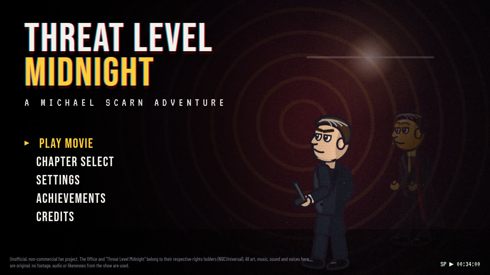 | 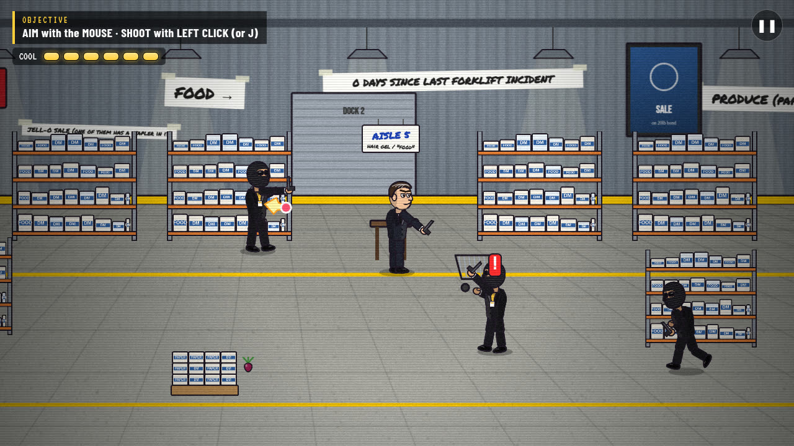 |
| 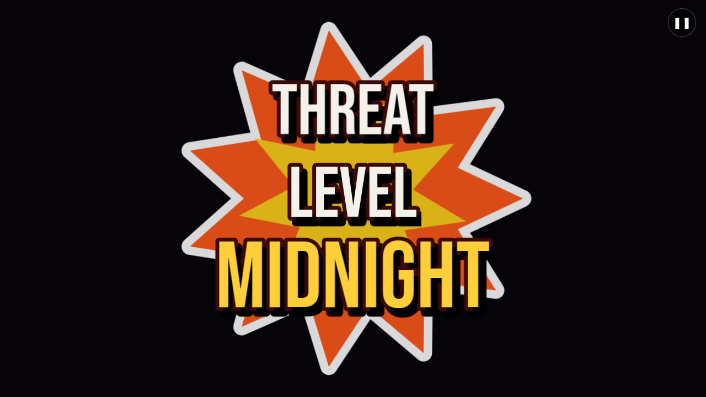 | 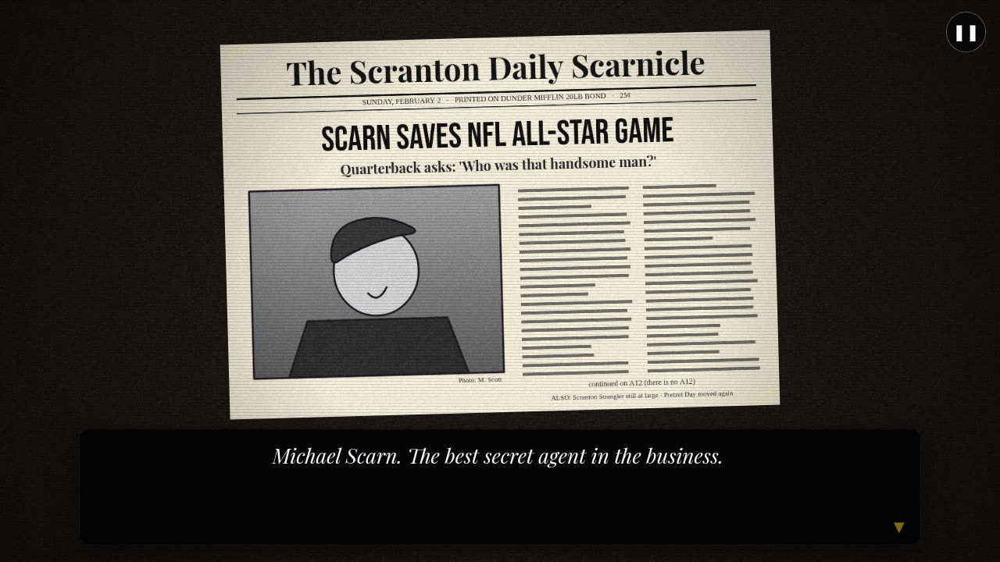 |
| 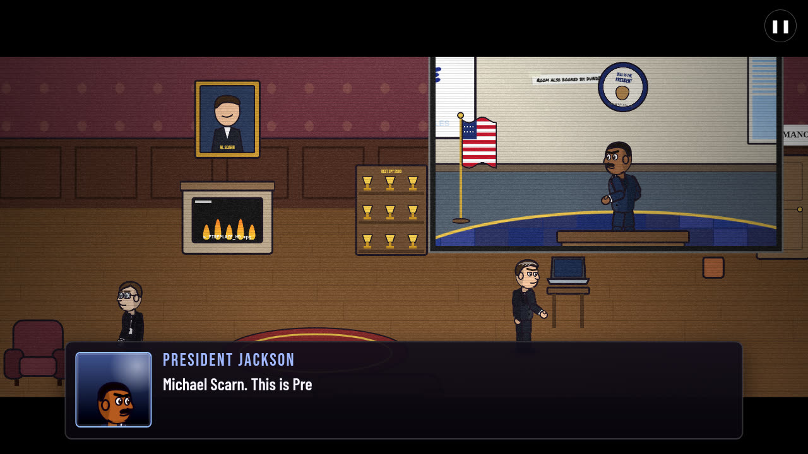 | 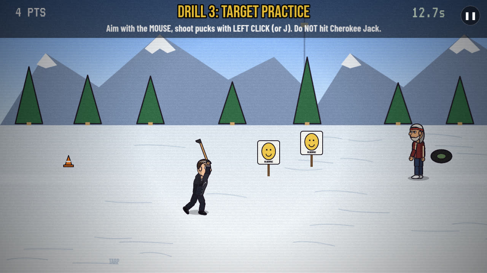 |
| 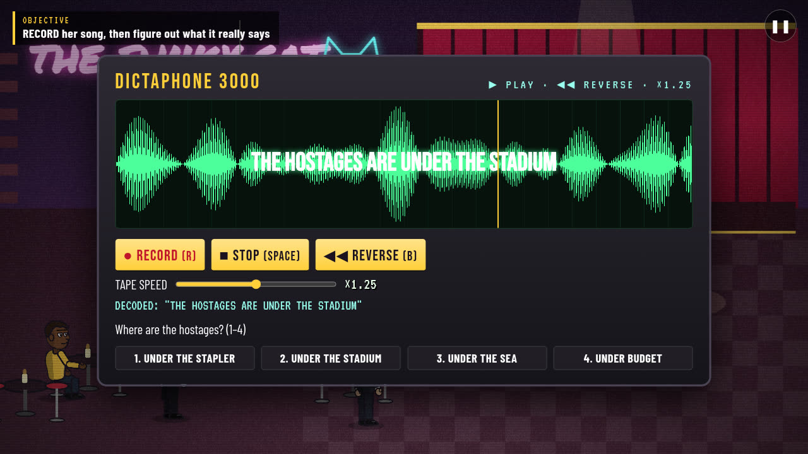 | 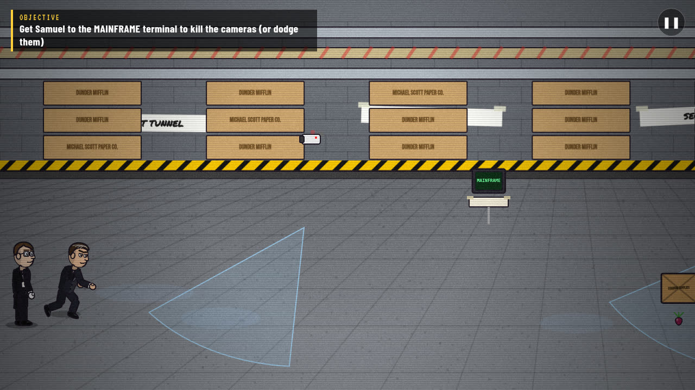 |
| 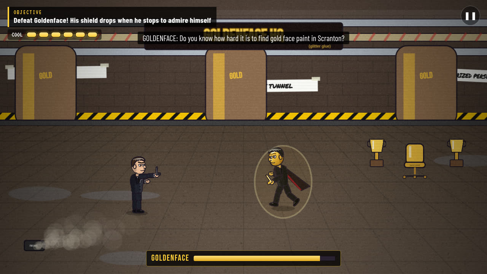 | 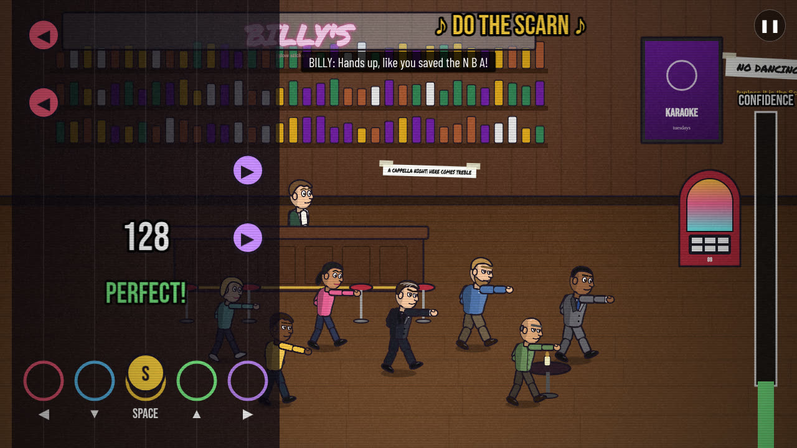 |
| 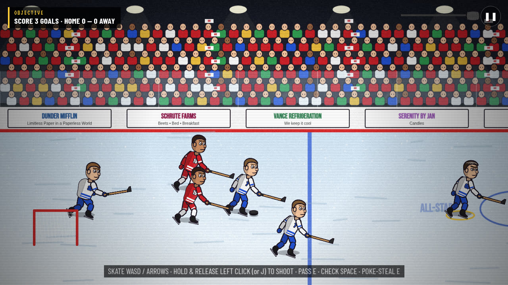 | 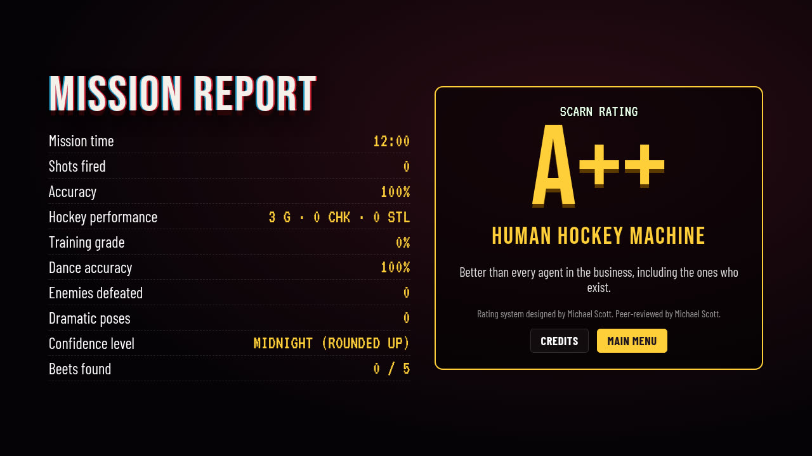 |

---

## Gameplay

Every story beat in the movie is something you *do*:

| # | Chapter | What you play |
|---|---|---|
| 1 | **Cleanup on Aisle Five** | A tutorial shoot-out in a "supermarket" that is clearly a paper warehouse: move, aim, shoot, dodge-roll, interact. Scarn winds up his big one-liner and the store PA steals it, so he saves it for later. Then the THREAT / LEVEL / MIDNIGHT title slam and Stanley narrating the newspaper montage. |
| 2 | **One Last Mission** | Samuel wakes a hungover Scarn. He's retired, until he hears it's Goldenface: "This makes it personal." In the Oval Office (a conference room with a flag), the President, who owns the stadium, briefs him: "We're at Threat Level... Midnight." Pick comic responses, then settle it with a best-of-seven coin flip and "Looks like there's gonna be a cleanup on aisle five." |
| 3 | **Cherokee Jack** | A training montage of five 15–30 second minigames: mop the ice, stick handling, target shooting, obstacle skating, reflexes. Scarn declares himself elite whatever you score. |
| 4 | **The Tryout** | Stride-timing speed-skating race, Goldenface (Jim, clearly reading a cue card) crashes it, a skate-and-shoot fight, disqualification, then locker-room stealth with a disguise and a photo swap on the All-Star pass. It ends the movie's way, kept PG: a smashed mirror and Chad rolled up in the American flag. |
| 5 | **The Funky Cat** | Jazz-club exploration and clues. Jasmine won't talk, so Scarn makes her fall in love with him (pick your pickup line). Her song hides a message: record, replay, reverse, fix the speed and read the waveform to decode it. A visual solution path means it's fully solvable with sound off. Then a blow dart, and last words about her candles. |
| 6 | **Under the Stadium** | The biggest level. Vision-cone stealth, security cameras, Samuel's hacking, keycards, chattering-teeth distraction gadgets, sneak takedowns, and the hostages (Pam, Kevin, Toby). Goldenface shoots Toby to show he means business, and Michael replays the most expensive shot in the movie from four angles. Goldenface explains the gold factory, "THE BOMB IS INSIDE THE PUCK", a three-phase boss, and the forgive-me offer that Scarn answers with "Go puck yourself!" |
| 7 | **The Hospital** | The nurse (Pam's mom) leans in to check that everything is working properly, and the heart monitor (a laptop) goes wild. Then mash to sit up while every indicator begs you to stop. |
| 8 | **The Betrayal** | Scarn tells the President the bomb is in the puck. The President makes a quick call and brings in Goldenface and his assassin. Auto-run hallway escape (parkour), then Scarn in the watering-can rain wondering where it all went wrong. |
| 9 | **Do the Scarn** | Billy (Andy) gets a kid to put G9 on the jukebox. Scarn hasn't done that dance since his wife died. A five-lane rhythm game to an original song with combo and confidence meters, and the whole bar joins in, bachelorette party included. |
| 10 | **NHL All-Star Game** | Arcade hockey (skate, carry, pass, steal, check, charged slapshot), a bomb-puck keep-away, radio cutaways to Samuel, Cherokee Jack's very cheap ghost, a charge-and-aim super shot, and the puck's flight into space. |
| 11 | **Scarn Manor** | Breakfast in the glow of the trophy ("somebody should make a movie about this"). Samuel is definitely not an android. The phone rings: it's the President, who forgot he was evil, with a new mission. Freeze frame, credits, the full cut's post-credits bit ("Threat Level Noon"), then the Mission Report. |

**Also in the game**
- **Mission Report**: mission time, shots, accuracy, hockey, training, dance, enemies, dramatic poses, confidence level, beets, and a **Scarn Rating** that never goes below A. Michael designed it.
- **Screening Mode** (on by default, toggle in Settings): short intermissions of stylized office silhouettes watching the movie, with a camera glance and polite applause.
- **12 achievements**, some hidden (there are five beets hidden across the chapters).
- **Saves** go to `localStorage` with a checkpoint at every beat. **Chapter Select** unlocks chapters as you complete them.
- **The cast, credited.** Every name plate shows who is playing the part (Samuel L. Chang, *played by Dwight Schrute*), and when a take goes wrong, Michael yells a director's note through his megaphone before the "CUT! TAKE 2" clapper.
- **Office references** throughout the sets: WUPHF, Schrute Farms, Serenity by Jan, Vance Refrigeration, Poor Richard's, Sabre, the Dundies, Pretzel Day, a stapler in Jell-O, Prison Mike's locker, the Rabies Awareness Fun Run, the Finer Things Club, Here Comes Treble, Michael Scott Paper Company, and more.

---

## Controls

| Action | Keyboard / mouse | Gamepad | Touch |
|---|---|---|---|
| Move | WASD / arrow keys | Left stick | Virtual stick |
| Aim | Mouse | Right stick | Auto-aim |
| Shoot | Left click or J / K | RT | FIRE |
| Dodge roll | Space / Shift / L / right click | B | ROLL |
| Interact / talk / advance | E / Enter | A | USE / tap |
| Dramatic pose (purely for flair, tracked as a stat) | F | Y | POSE |
| Gadget (Ch. 6) | Q | LB | GADGET |
| Mash (hospital, boss) | Space | A | A |
| Pause | Esc / P | Start | ❚❚ |

**Hockey:** skate with WASD, hold and release left click (or J) to charge a slapshot, E to pass
(or poke-check without the puck), Space to body-check.
**Rhythm:** ← ↓ Space ↑ → (the middle lane is the SCARN move). Arrow keys or WASD both work.

Hints on screen always name the controls for the device you're currently using.

---

## Settings & accessibility

- Master, music, sound-effect and voice volume, plus mute everything and voice acting on/off.
- Captions for all dialogue, barks, radio and important sound cues. Normal and large text sizes. Auto-advance dialogue.
- Reduced flashing, reduced screen shake, high-contrast indicators, and a toggle for the VHS film effects.
- **Assist mode**: slower enemy fire and bullets, longer telegraphs, a less durable Goldenface, wider rhythm windows (plus an easier chart), easier mashing and gentler hockey AI.
- Rhythm latency offset.
- Fullscreen, touch controls toggle, and pause anywhere (the game auto-pauses when the tab is hidden).
- **Restart checkpoint** from the pause menu. A fight you lose becomes a "CUT! TAKE 2" retake, not a game over.
- No progression depends only on hearing. The audio puzzle has a waveform-letters solution path.

---

## Tech stack

| | Version | Role |
|---|---|---|
| [Phaser](https://phaser.io) | 4.2.1 | Game scenes, cameras, tweens, particles, filters |
| [React](https://react.dev) | 19.3 | Shell: menus, settings, dialogue, cards, HUD, tape deck, credits, stats |
| [TypeScript](https://www.typescriptlang.org) | 6.0 | Strict mode everywhere |
| [Vite](https://vite.dev) | 8.3 (Rolldown) | Dev server and production build (Phaser split into its own chunk) |
| [Vitest](https://vitest.dev) | 5.0 | Unit tests |
| ESLint + typescript-eslint | 10 / 8.70 | Linting |
| Playwright | 1.56 | Scripted playthrough QA |
| Node | ≥ 22.12 | Required by Vite 8 |

The brief suggested Phaser 3. Research at build time showed that Phaser 3's final release was
3.90 (May 2025) and that Phaser 4 is now the maintained stable line, so the game uses Phaser 4,
following its v3→v4 migration guide (no `setTintFill`, filters instead of FX pipelines,
`addCanvas` textures). There are no runtime dependencies beyond Phaser, React and React DOM, and
no backend.

---

## Architecture

```
src/
  App.tsx, main.tsx     React root. Mounts the Phaser canvas and the UI layers on top.
  components/           Menus, Settings, Dialogue box, Cards, HUD, Pause, TapeDeck,
                        TouchControls, Credits, Stats
  state/                Tiny observable store + save, settings, stats, UI bridge, tape puzzle
  data/                 Chapters, cast (voice + portrait per speaker), achievements,
                        script/ch01–ch11.ts (every line of dialogue, with a stable voice id)
  audio/                Web Audio engine (buses, reverb, limiter, ducking), synth instruments,
                        step sequencer + 21 original music cues, ~80 synthesized SFX, voice player
  game/
    Director.ts         Chapter flow: start, continue, checkpoint restart, pause, next chapter
    createGame.ts       Phaser config (1280×720 logical, Scale.FIT)
    art/                Procedural Canvas 2D art: ~40 characters, ~110 props, 18 backgrounds,
                        newspapers, portraits
    entities/           Rig (cut-out bone puppet), Actor, Scarn, Goon, Goldenface, Samuel
    systems/            ChapterScene base, World (floor-plane collision + line of sight),
                        Combat, Encounter waves, Stealth (guards, cameras, noise), Input, Moves
    minigames/          CoinFlip, Training (×5), Race, Hack, Mash, Rhythm (+ pure chart.ts),
                        Hockey, SuperShot
    scenes/             Boot, Attract (menu backdrop), Overlay (VHS grain, letterbox, title slam,
                        clapperboard), Screening, Ch01–Ch11
tools/
  voice/                Offline voice pipeline (export lines → Kokoro TTS → ffmpeg FX → MP3)
  qa/                   Playwright scenario driver + chapter scenarios
public/
  voice/                389 pre-rendered voice lines (≈6.3 MB, lazy-loaded) + manifest.json
  fonts/                Self-hosted OFL fonts
docs/DESIGN_BIBLE.md    Research notes, story/scene/character/environment/comedy bibles,
                        gameplay mapping, technical/asset/QA plans
```

**Key decisions**

- **React owns the shell and Phaser owns the world.** They talk through a small observable
  store (`useSyncExternalStore`) and a promise API. `await this.say(line)`,
  `await this.choose(...)` and `await this.card(...)` resolve when the player advances, so
  every chapter reads as linear async code.
- **Chapters are lists of beats.** Each beat is an `async` function and also a checkpoint.
  Shutting down a scene aborts an `AbortSignal`, which cancels every pending wait, tween,
  dialogue and frame loop. Restarting a checkpoint or quitting to the menu can't leave orphaned
  promises or listeners behind.
- **All art is procedural.** Characters are cut-out rigs (nested containers for torso, head,
  arms and legs) painted with Canvas 2D at load, with pose easing and procedural walk, run,
  skate and dance cycles. Every character shares the same proportions, line weight and palette.
  There are no image files and no placeholder rectangles.
- **All music is synthesized live.** A look-ahead step sequencer drives FM electric piano,
  organ, strings, brass, guitar, sax and drum instruments, so the whole score costs 0 bytes of
  audio assets.
- **The rhythm game runs on the audio clock.** Notes are timed against `AudioContext` time,
  presses use `KeyboardEvent.timeStamp`, and output latency plus a user offset are applied.
  Windows are ±55 / 110 / 160 ms (×1.6 in Assist).
- **The same floor-plane "belt" view** (as in Streets of Rage and NES Ice Hockey) is used for
  shooting, stealth, exploration and hockey, so one camera language and one rig style work everywhere.
- **Voice** is pre-rendered offline, fetched per line, and ducks the music while it plays.
  Captions work with voices muted.

---

## Development

```bash
npm ci
npm run dev          # http://localhost:5173
npm test             # vitest: rhythm chart/judge, Scarn Rating, store, song patterns
npm run lint
npm run typecheck
npm run build        # tsc -b && vite build → dist/
npm run preview      # serve the production build on :4173
```

**Handy URL flags:**
- `?unlock=all` unlocks every chapter in Chapter Select (for reviewers).
- `?renderer=canvas` forces the Canvas renderer, which is fast in headless browsers but drops
  the camera filters.

**Scripted QA:** with the dev server or preview running, run
`npm run qa -- tools/qa/scenarios/<name>.mjs`:

| Scenario | Covers |
|---|---|
| `ch01` … `ch05` | Chapters 1–5 with real keyboard and mouse input |
| `late` | Chapters 6–11 through the credits and stats (`FROM=9` starts at a later chapter) |
| `rhythm` | Do the Scarn played by a key-pressing bot (`BOT=bad` tests fail → retry → assist) |
| `hockey` | All-Star Game played by a key-pressing bot (`PERIOD1=1` stops after period 1) |
| `boss` | Goldenface fight with real input (god mode on) |
| `system` | Fresh-save locks, settings persistence, pause, restart checkpoint, chapter unlock |
| `viewport` | `VP=1366x768` etc.: 16:9 scaling, no overflow or page scroll |
| `touch` | `TOUCH=1 VP=844x390`: virtual stick and touch buttons |
| `webgl` | Run with `--webgl`: filter-heavy moments on the WebGL renderer |
| `readme` | Recaptures the story moments used in the README screenshots |

`BASE=http://localhost:4173` targets `npm run preview`. The default Canvas renderer keeps
headless runs fast; pass `--webgl` to test the WebGL path.
Screenshots go to `tools/qa/out/`, which is ignored by git. The page exposes
`window.__TLM__` test hooks: jump to a chapter, advance dialogue, read state, and set QA
flags (`autoWin`, `skipFights`, `god`).

**Regenerating voices:** edit a line in `src/data/script/`, then

```bash
npm run voice:export                         # writes tools/voice/lines.json
KOKORO_DIR=/path/to/models npm run voice:generate
```

This needs Python 3 with `kokoro-onnx` and `soundfile`, ffmpeg, and the Kokoro model files
(`kokoro-v1.0.onnx`, `voices-v1.0.bin`). Only new or changed lines are rendered
(`tools/voice/hashes.json`).

---

## Deployment

The project is a static Vite build and deploys to Vercel with the included `vercel.json`:

- `framework: vite`, `buildCommand: npm run build`, `outputDirectory: dist`
- An SPA fallback rewrite that sends everything except `/assets/`, `/voice/` and the favicon to
  `/index.html`, so direct reloads of any URL work.
- `Cache-Control: public, max-age=31536000, immutable` for hashed `/assets/*`, and a 7-day cache for `/voice/*`.

**Live:** https://threat-level-midnight.vercel.app (Vercel project `threat-level-midnight`).

**Redeploying**

1. **Git integration (current setup).** The Vercel project is connected to
   `indiVar0508/Scarn-Midnight-Protocol`. Every push to the production branch builds and
   deploys automatically; other branches get preview URLs.
2. **CLI:**
   ```bash
   npm i -g vercel
   vercel link          # pick the team and the "threat-level-midnight" project
   vercel --prod
   ```

The build needs no environment variables or secrets.

---

## Research & Design

Before any code, the source material was researched and written up in
[`docs/DESIGN_BIBLE.md`](docs/DESIGN_BIBLE.md). The main finding was that the source has three
separate layers, each used differently in the game:

1. **The fictional movie** (Scarn, Goldenface, the bomb in the puck, the Scarn dance, the ghost,
   the satellite) became the **playable story**, chapter by chapter, in its original order.
2. **Michael's filming process** (shot over years in the office, with coworkers as the cast and
   a famously replayed "expensive" effect) became the **visual language**. Every set is an office
   pretending to be something grander: the Oval Office has "Q3 SALES" half-erased on its
   whiteboard, the ICU's heart monitor is a laptop, the satellite is cardboard and foil, the
   crowd is one sprite repeated, the snow is the same dozen flakes, and henchmen fall down late.
3. **The episode's screening** (the staff watching Michael's movie) became the optional
   **Screening Mode** intermissions.

What makes the movie funny is that **Michael takes absurd things completely seriously**. So the
characters never say the movie is bad. Scarn's lines are sincere, Goldenface is theatrical,
Samuel is literal, and the comedy comes from the gap between their conviction and the
cardboard around them. The rule in the Comedy Bible was *the game is well made; the movie
inside it is not*: controls, readability and UI are never the joke.

Game-design research shaped the mechanics:
- **Juice** (Vlambeer's "The Art of Screenshake"): hitstop, recoil and knockback, all scaled by the
  comfort settings.
- **Readable stealth** (Mark of the Ninja): cones are always visible and suspicion ramps from
  "?" to "!".
- **Audio-clock rhythm timing** (Rhythm Heaven and rhythm-game devlogs), plus generous
  **retry/assist** design (Celeste).
- **Checkpoints at every beat.**

Research method: web searches cross-referencing Wikipedia, Dunderpedia (The Office wiki),
TV Tropes, IMDb (the episode and the 2011/2019 *Threat Level Midnight: The Movie* release),
Nerds and Beyond, Consequence, Cinemablend, Looper, Paste, Give Me My Remote and OfficeQuotes.net
for story beats. Technical decisions came from the current docs and changelogs for Phaser 4
(including its migration guide), Vite 8, React 19, Vercel, and the Chrome autoplay policy for
Web Audio. No transcripts are included here or in the game. Dialogue is original, with only
a few short paraphrased callbacks.

---

## Asset attribution

| Asset | Source | License |
|---|---|---|
| All character art, props, backgrounds, newspapers, portraits, UI | Original, drawn procedurally with Canvas 2D in `src/game/art/` | This project |
| All music (21 cues) | Original compositions, synthesized live with Web Audio (`src/audio/songs.ts`) | This project |
| All sound effects | Synthesized with Web Audio (`src/audio/sfx.ts`) | This project |
| Voice acting (446 lines) | Generated offline with [Kokoro-82M](https://huggingface.co/hexgrad/Kokoro-82M) via kokoro-onnx. Each character is a blend of stock Kokoro voices, pitch-shifted and EQ'd toward the register and energy of the Dunder Mifflin employee playing the role (deep and slow for Stanley, bright for Andy, clipped and nasal for Dwight), then given ffmpeg scene effects | Kokoro model: Apache-2.0. No recording of any actor was used, sampled or cloned. |
| Fonts: Bebas Neue, Barlow Condensed, Permanent Marker, Playfair Display, Special Elite, VT323 | Google Fonts, self-hosted in `public/fonts/` | SIL Open Font License 1.1 (see `public/fonts/LICENSES.md`) |
| Engine and libraries | Phaser, React, Vite and others | MIT |

---

## Known limitations

- **Voices are synthetic.** Each one is cast and tuned to evoke its actor's register, pace and
  energy, but they are not the actors' voices and never will be: cloning a real person's voice
  without consent is off the table. Delivery is clearer than it is funny; the jokes are carried by
  the writing and the timing.
- **Testing.** Every chapter was played end to end by scripted Playwright runs in headless
  Chromium (`tools/qa/scenarios`). Chapters 1–5 used real keyboard and mouse input. The rhythm
  game, the hockey game and the Goldenface boss were also played by in-page bots sending real
  key events: a good rhythm run passes first time at about 92%, a sloppy one fails, retries and
  passes with the assist chart. The chapter 6 stealth rooms and some story beats were driven
  with QA assists (teleport, skip fights). Saves, settings persistence, pause/restart
  checkpoint, chapter unlocks, six viewport sizes and touch controls have their own scenarios.
  Firefox and Safari (desktop and iOS) were not tested on real devices. The Web Audio features
  used are standard, but Safari may behave differently.
- **The Canvas renderer fallback** (used automatically when WebGL is unavailable) skips the
  camera filters: grayscale, sepia and soft focus.
- **Touch** works for every chapter, but the game is designed for keyboard and mouse. Phones
  should be held in landscape.
- The hockey AI is intentionally simple and arcade-like.

---

## Fan-project disclaimer

This is an unofficial, non-commercial fan tribute made for fun. *The Office*, *Threat Level
Midnight*, and all related characters and names are the property of their respective rights
holders. No copyrighted footage, stills, audio, music, lyrics, likenesses or voices are
included. If you are a rights holder and have a concern, please open an issue.
